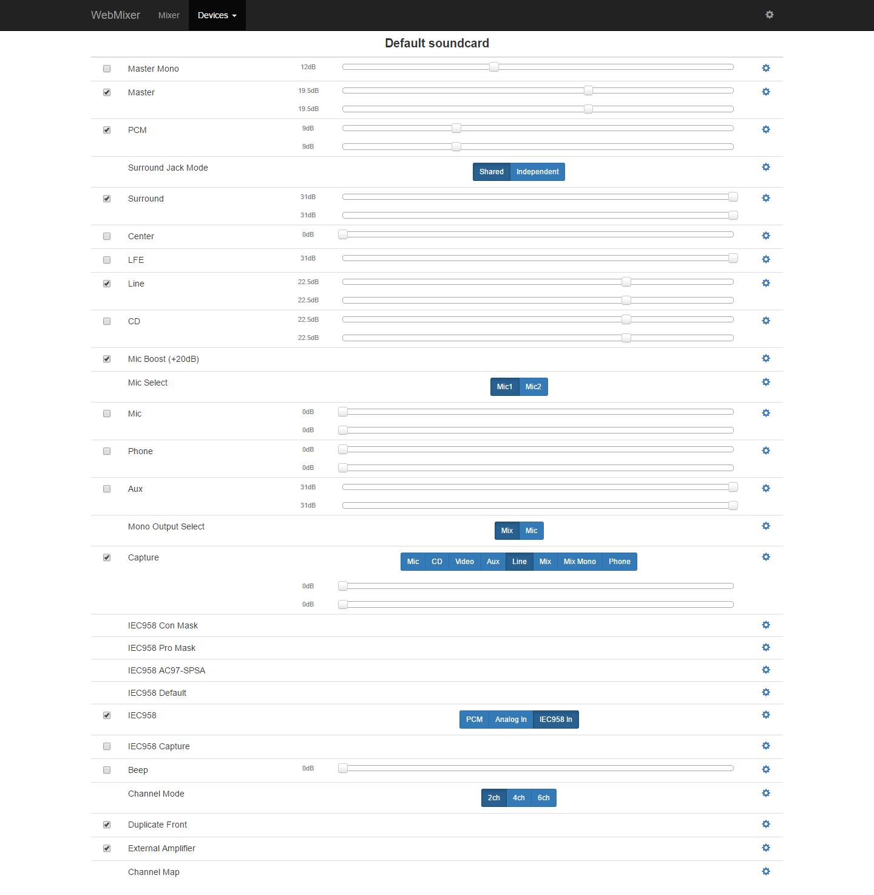
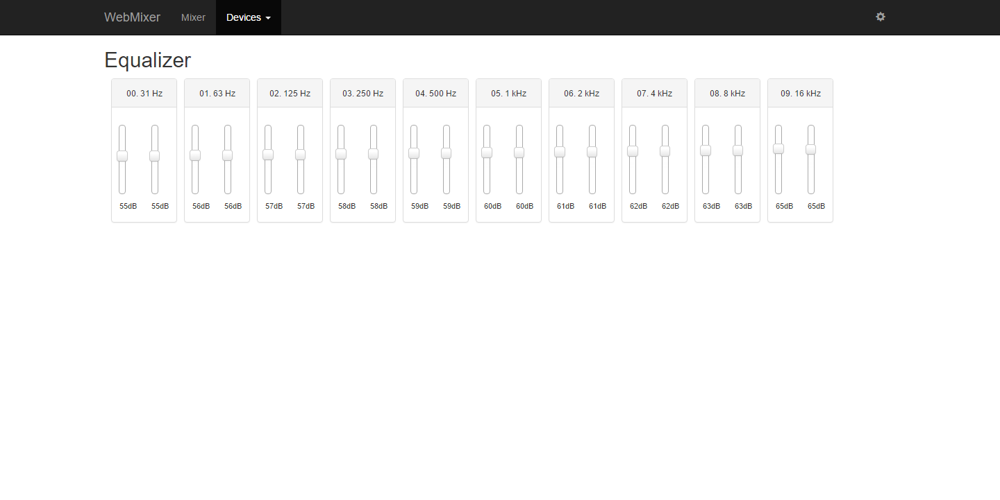

# WebMixer - Alsamixer & Alsaequal in the browser

[](LICENSE)

Client-server application for easy configuration of ALSA volume controls using network device (smartphone, tablet, PC, etc.).

[](screen.mixer.png)
[](screen.mixer.png)

## Server requirements

- php5


## Supported browsers
- Chrome* 
- Firefox*
- Chrome (Android)*
*Doest mean that wont run on other browsers. I just don't tested with the others yet.
## Getting Started

### Download / Clone

```bash
$ git clone https://github.com/elovattibr/webmixer.git
```

Alternatively you can [download](https://github.com/elovattibr/webmixer/archive/master.zip) this repository.

## Synopsis

```
php index.php
```
This way you get an standalone application without need of
external web server like apache or nginx.

If you want it to, you must setup URL rewriting properly,
and run it as a normal website.
Just make sure that the webserver is running with an 
user member of audio group and access to the amixer is granted
and write permission to the config folder.

Configuration will be found in config/application.php.

## Equalizer support
For equalizer you must install alsaequal for your distribution. 
All the major ones have it on their repositories.
